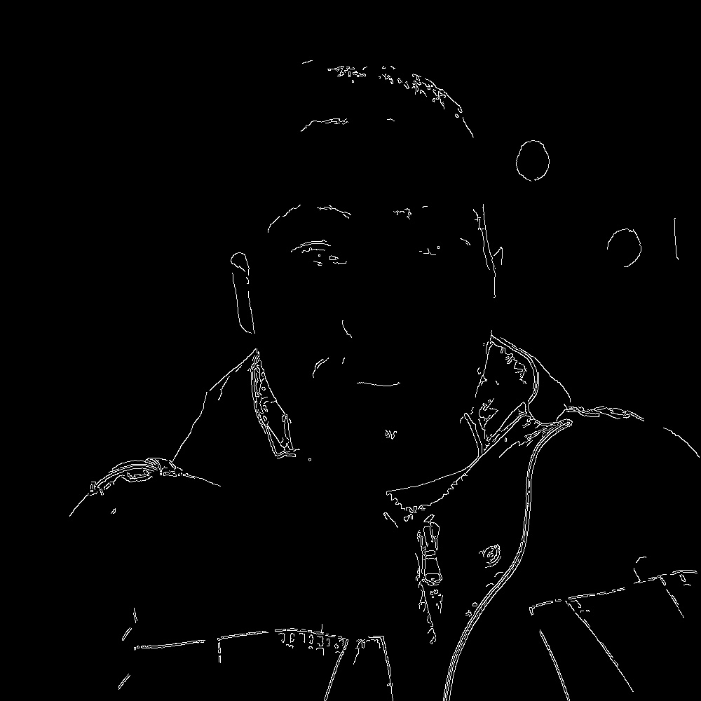

# Canny Segmnation
This project is about how to use opencv to make segmnation on image in python

``` python
import cv2

# Load my image
img = cv2.imread("my_pic.jpg")

# Convert the image to grayscale
gray = cv2.cvtColor(img, cv2.COLOR_BGR2GRAY)

# Apply Canny edge detection
edges = cv2.Canny(gray, 100, 200)  # Adjust thresholds as needed

# Display the original image and the edge detected image
cv2.imshow("Original Image", img)
cv2.imshow("Canny Edges", edges)

# Wait for a key press to exit
cv2.waitKey(0)
cv2.destroyAllWindows()
```
## Result
<div>



</div>
